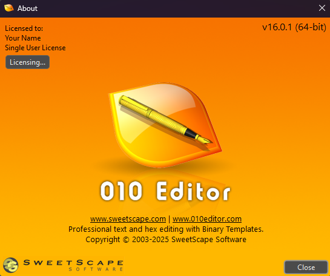

# 010Editor License Generator

A Python script to generate various types of licenses for 010Editor using command-line arguments.

## Features

- Generate Time-based licenses (with expiration)
- Generate Version-specific licenses
- Generate Trial licenses
- Clean, readable command-line interface using argparse

## Installation

1. Ensure you have Python 3.x installed
2. Clone or download this repository
3. No additional dependencies required (uses built-in argparse)

## Usage

### Basic Syntax
```bash
python main.py <license_type> <arguments>
```

### License Types

#### 1. Time License
Generates a time-based license that expires after a specified number of days.

```bash
python main.py time "User Name" <users> <days>
```

**Example:**
```bash
python main.py time "John Doe" 5 365
```
This creates a time license for "John Doe" with 5 users and 365 days validity.

#### 2. Version License
Generates a version-specific license for a particular version of 010Editor.

```bash
python main.py version "User Name" <users> <version>
```

**Example:**
```bash
python main.py version "Jane Smith" 10 14
```
This creates a version license for "Jane Smith" with 10 users for version 14.

#### 3. Trial License
Generates a trial license (default 365 days).

```bash
python main.py trial "User Name"
```

**Example:**
```bash
python main.py trial "Bob Johnson"
```
This creates a trial license for "Bob Johnson".

## Help

To see all available options and examples:

```bash
python main.py --help
```

## Output

Each command will output a license key in the format:
```
XXXX-XXXX-XXXX-XXXX-XXXX
```

## Notes

- User names should be enclosed in quotes if they contain spaces
- All numeric arguments (users, days, version) must be integers
- The script validates input arguments automatically

## License

This project is for educational purposes only. Use at your own risk.

