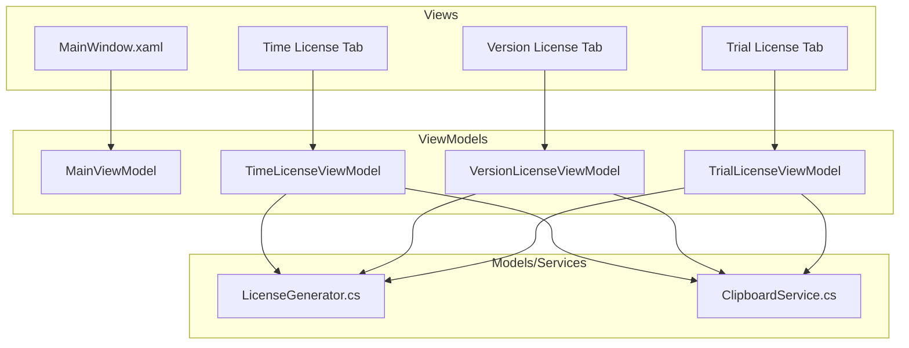

# 010Editor License Generator - C# WPF GUI Application Plan

## Overview

This plan outlines the architecture and implementation steps for creating a C# WPF GUI application using .NET 8 that replicates the functionality of the existing Python license generator.

## Requirements Summary

- **Framework**: .NET 8 with WPF (Windows Presentation Foundation)
- **Architecture**: MVVM (Model-View-ViewModel) pattern
- **Features**:
  - Generate Time License (ac) - with days expiration
  - Generate Version License (9c) - version-specific
  - Generate Trial License (fc) - trial license
  - Copy generated license to clipboard
- **UI**: Basic functional interface with input fields and generate buttons

---

## Architecture Diagram



---

## Project Structure

```
010EditorLicenseGenerator/
├── 010EditorLicenseGenerator.csproj
├── App.xaml
├── App.xaml.cs
├── MainWindow.xaml
├── MainWindow.xaml.cs
├── Models/
│   └── LicenseResult.cs
├── ViewModels/
│   ├── BaseViewModel.cs
│   ├── MainViewModel.cs
│   ├── TimeLicenseViewModel.cs
│   ├── VersionLicenseViewModel.cs
│   ├── TrialLicenseViewModel.cs
│   └── RelayCommand.cs
├── Services/
│   ├── ILicenseGenerator.cs
│   ├── LicenseGenerator.cs
│   └── ClipboardService.cs
└── Resources/
    └── Styles.xaml
```

---

## Core Components

### 1. LicenseGenerator.cs - Core Algorithm Port

Port the Python license generation logic to C#:

```csharp
// Key methods to implement:
public class LicenseGenerator : ILicenseGenerator
{
    private readonly uint[] _raw; // 256 element lookup table
    
    // Encoding methods (from Python)
    private uint EncodeUsesLeft(int n);
    private uint EncodeName(string name, bool isNotFcLicense, int left, int nUsers);
    private uint EncodeUsers(int num);
    private uint EncodePasswordDate(int a, uint b);
    private string FormatLicense(byte[] p);
    
    // Public license generation
    public string GenerateTimeLicense(string name, int numUsers, int daysLeft);      // 0xAC
    public string GenerateVersionLicense(string name, int numUsers, int version);    // 0x9C
    public string GenerateTrialLicense(string name, int offset = 365);               // 0xFC
}
```

### 2. UI Layout - MainWindow.xaml

The main window will use a `TabControl` with three tabs:

```
┌─────────────────────────────────────────────────────┐
│  010Editor License Generator                    [X] │
├─────────────────────────────────────────────────────┤
│  [Time License] [Version License] [Trial License]   │
├─────────────────────────────────────────────────────┤
│                                                     │
│   User Name:    [________________________]          │
│                                                     │
│   Number of Users:  [____]                          │
│                                                     │
│   Days:            [____]                           │
│                                                     │
│   [        Generate License        ]                │
│                                                     │
│   Generated License:                                │
│   ┌─────────────────────────────────────────────┐   │
│   │ XXXX-XXXX-XXXX-XXXX-XXXX                    │   │
│   └─────────────────────────────────────────────┘   │
│                                                     │
│   [    Copy to Clipboard    ]                       │
│                                                     │
└─────────────────────────────────────────────────────┘
```

### 3. ViewModels - MVVM Pattern

Each tab will have its own ViewModel with:
- Input properties (Name, Users, Days/Version)
- Output property (GeneratedLicense)
- Commands (GenerateCommand, CopyCommand)
- Validation logic

---

## Implementation Steps

### Step 1: Create .NET 8 WPF Project

```bash
dotnet new wpf -n "010EditorLicenseGenerator" -f net8.0
cd 010EditorLicenseGenerator
```

### Step 2: Create Project File Structure

Create the folder structure:
- Models/
- ViewModels/
- Services/
- Resources/

### Step 3: Implement Core Services

#### 3.1 LicenseGenerator.cs

Port the Python `raw` lookup table and all encoding functions:

| Python Function | C# Method |
|-----------------|-----------|
| `encode_uses_left(n)` | `EncodeUsesLeft(int n)` |
| `encode_name(name, is_not_fc_license, left, n_users)` | `EncodeName(string, bool, int, int)` |
| `encode_users(num)` | `EncodeUsers(int num)` |
| `encode_password_date(a, b)` | `EncodePasswordDate(int a, uint b)` |
| `format_license(p)` | `FormatLicense(byte[] p)` |
| `generate_license_9c()` | `GenerateVersionLicense()` |
| `generate_license_ac()` | `GenerateTimeLicense()` |
| `generate_license_fc()` | `GenerateTrialLicense()` |

**Key Implementation Notes:**
- Use `uint` for unsigned 32-bit operations
- Handle integer overflow correctly (use `unchecked` blocks)
- The `raw` array has 256 elements from Python code

### Step 4: Implement MVVM Infrastructure

#### 4.1 BaseViewModel.cs
```csharp
public class BaseViewModel : INotifyPropertyChanged
{
    public event PropertyChangedEventHandler PropertyChanged;
    protected void OnPropertyChanged([CallerMemberName] string name = null);
}
```

#### 4.2 RelayCommand.cs
```csharp
public class RelayCommand : ICommand
{
    private readonly Action<object> _execute;
    private readonly Predicate<object> _canExecute;
}
```

### Step 5: Create ViewModels

#### 5.1 TimeLicenseViewModel
- Properties: UserName, NumberOfUsers, Days, GeneratedLicense
- Commands: GenerateCommand, CopyToClipboardCommand

#### 5.2 VersionLicenseViewModel
- Properties: UserName, NumberOfUsers, Version, GeneratedLicense
- Commands: GenerateCommand, CopyToClipboardCommand

#### 5.3 TrialLicenseViewModel
- Properties: UserName, GeneratedLicense
- Commands: GenerateCommand, CopyToClipboardCommand

### Step 6: Design XAML Views

#### 6.1 MainWindow.xaml
- TabControl with 3 TabItems
- DataTemplates for each license type
- Consistent styling across tabs

#### 6.2 Styles.xaml (Optional)
- Button styles
- TextBox styles
- Label styles

### Step 7: Wire Up Data Binding

Connect ViewModels to Views using DataContext and bindings.

### Step 8: Implement Clipboard Functionality

```csharp
public class ClipboardService
{
    public void CopyToClipboard(string text)
    {
        Clipboard.SetText(text);
    }
}
```

---

## Algorithm Port Details

### Raw Lookup Table

The Python `raw` array contains 256 pre-computed values. This needs to be ported as a static `uint[]` in C#:

```csharp
private static readonly uint[] Raw = new uint[]
{
    969622712, 594890599, 1593930257, /* ... all 256 values ... */
};
```

### Encoding Functions Port

**Python:**
```python
def encode_users(num):
    return (num*11 ^ 0x3421)-0x4d30 ^ 0x7892
```

**C# Equivalent:**
```csharp
private static uint EncodeUsers(int num)
{
    unchecked
    {
        return (uint)(((num * 11) ^ 0x3421) - 0x4d30) ^ 0x7892;
    }
}
```

### License Format

Output format: `XXXX-XXXX-XXXX-XXXX-XXXX` (for 10-byte licenses)
or `XXXX-XXXX-XXXX-XXXX` (for 8-byte licenses)

---

## Testing Strategy

1. **Unit Tests**: Test each encoding function against known Python outputs
2. **Integration Tests**: Generate licenses and compare with Python script output
3. **Manual Testing**: Verify UI functionality and clipboard operations

### Test Cases

| Test | Input | Expected Output |
|------|-------|-----------------|
| Time License | name="Test", users=1, days=365 | Compare with Python output |
| Version License | name="Test", users=1, version=14 | Compare with Python output |
| Trial License | name="Test" | Compare with Python output |

---

## Dependencies

The project requires minimal dependencies:

```xml
<Project Sdk="Microsoft.NET.Sdk">
  <PropertyGroup>
    <OutputType>WinExe</OutputType>
    <TargetFramework>net8.0-windows</TargetFramework>
    <UseWPF>true</UseWPF>
  </PropertyGroup>
</Project>
```

No external NuGet packages required for basic functionality.

---

## Risks and Considerations

1. **Algorithm Accuracy**: Ensure C# integer overflow behavior matches Python
2. **Character Encoding**: Verify uppercase conversion works correctly for all characters
3. **Clipboard Access**: WPF `Clipboard.SetText()` requires STA thread

---

## Summary

This plan creates a clean, maintainable WPF application following MVVM patterns that replicates the Python license generator functionality with a user-friendly GUI. The implementation focuses on:

- Clean separation of concerns (MVVM)
- Accurate port of the license generation algorithms
- Simple, functional user interface
- Clipboard integration for easy license copying
